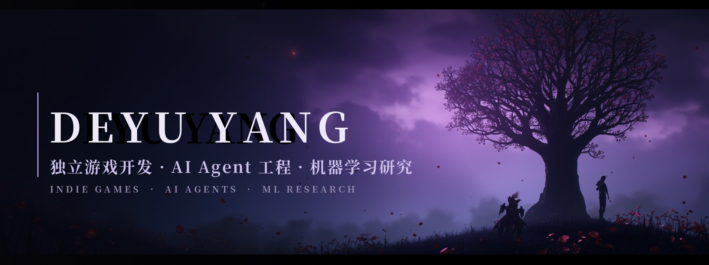

**Deyu Yang** · 广东东莞 · 独立开发者

**中文** / [English](#-english) · 我造游戏、造工具、也做研究 —— 相信「不重复造轮子」和「必要时亲手造引擎」并不矛盾。

---

## 🔭 正在做

- 🌸 **[回声 · 枯荣之环](https://github.com/Deyu008/witherbloom-cycle)** — 无引擎、纯手写 Canvas 2D 的像素风动作 RPG：四章节双线结局（击败 / 释怀 BOSS）、Hades 式祝福构筑、程序生成地牢、WebAudio 全合成音频。**~12,500 行、53 个 ES 模块、零运行时依赖、216 项回归测试。**
- 🧪 **[paperlab](https://github.com/Deyu008/paperlab)** — 开源论文研究 Agent harness：文献综述 → 实验规划 → 沙箱执行 → 结果解读 → LaTeX 成稿 → 自动同行评审。
- 🔬 **[ALF](https://github.com/Deyu008/ALF)** — Sharpness-Aware Adaptive Layer Fusion，Training-Free 异常检测。
- 📊 **[visulite](https://github.com/Deyu008/visulite)** — 科研数据快速可视化 / 预处理 / 图表导出工具。

## 🛠️ 技术栈

## 📊 GitHub 数据

 

<picture>
  <source media="(prefers-color-scheme: dark)" srcset="https://raw.githubusercontent.com/Deyu008/Deyu008/output/github-contribution-grid-snake-dark.svg">
  <source media="(prefers-color-scheme: light)" srcset="https://raw.githubusercontent.com/Deyu008/Deyu008/output/github-contribution-grid-snake.svg">
  
</picture>

---

### 🌸 English

**Indie game dev · AI agent tooling · ML research.**
Author of *Echoes: The Witherbloom Cycle* — a no-engine, hand-written Canvas 2D pixel ARPG (4 chapters, dual-route boss "reconciliation" endings, ~12.5k lines, 216 tests, zero runtime deps). Also building **paperlab**, an open-source paper-research agent harness, and **ALF**, training-free anomaly detection via adaptive layer fusion.

*"Don't break the loop — walk into the memory."*

